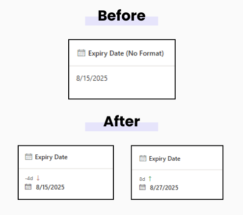

# Days Counter - SharePoint JSON Column Formatter

## Short Description  
Shows how many days are left until a date or how many days have passed since a date, right inside a SharePoint list column. Color-coded for quick scanning.

## Type 
Column Formatting (JSON)

## Applied To 
Date and Time column (any date field)

##### Example

## Sample
Solution|Author(s)
--------|---------
dayCounter.json | [Tanel Vahk](https://github.com/tvahk)

## Version history
Version |Date             |Comments
--------|-----------------|--------------------------------
1.0     |August 19, 2025 |Initial release

## Disclaimer
**THIS CODE IS PROVIDED *AS IS* WITHOUT WARRANTY OF ANY KIND, EITHER EXPRESS OR IMPLIED, INCLUDING ANY IMPLIED WARRANTIES OF FITNESS FOR A PARTICULAR PURPOSE, MERCHANTABILITY, OR NON-INFRINGEMENT.**

